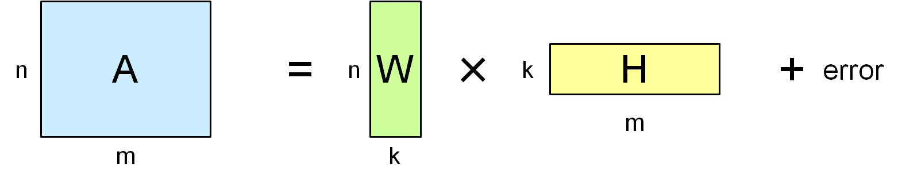

# NMFの各成分の寄与率を近似的に計算する方法 (2016/02/16)

## 説明

* NMF (nonnegative matrix factorization, 非負値行列因子分解) は、$n\times m$ の非負行列 $A$ を、$n\times k$ の非負行列 $W$ と $k\times m$ の非負行列 $H$ の積で近似する手法である。ここで $k$ は成分の数を表す。

* PCA (principal component analysis, 主成分分析) の場合には、各成分毎の寄与率を求めることが出来る。NMFでも同様のことが出来たら便利かもしれないと思い考えてみた。

* 以下の図のように、$W$ を列毎、$H$ を行毎に分解すると、元行列 $A$ に対する各成分由来の寄与分が得られることが分かる。

* 誤差項以外は非負なので、単純に $n\times m$ 個の要素の合計値を指標として、元行列に対する各成分由来の割合 $\rho_k$ を求めても良い:

  $$\begin{align}
  \rho_k &= \frac{\sum_{i,j}w_{ik}h_{kj}}{\sum_{i,j}a_{ij}},\\
  &= \frac{\sum_i w_{ik}\sum_j h_{kj}}{\sum_{i,j}a_{ij}}.
  \end{align}$$

* しかし、誤差があるために、寄与率の合計が100%を超えてしまう場合がある。これは直感に反する。また、$k$ が小さすぎる場合は元行列をうまく近似出来ないので、寄与率の合計は小さくなるのが自然と考えられるが、この定義ではそうはならない。

* そこで寄与率の式を修正する。誤差項が非負であれば良いので、絶対値を取った場合を考え、それに対応する新たな行列 $A'$ を用意する:

  $$\begin{align}
  a_{ij} &= \sum_k w_{ik} h_{kj} + r_{ij},\\
  a_{ij}' &= \sum_k w_{ik} h_{kj} + |r_{ij}|.
  \end{align}$$

* 行列 $A'$ は次のように計算出来る:

  $$\begin{align}
  a_{ij}' = a_{ij} - 2 \min(0, r_{ij}).
  \end{align}$$

* 修正版の寄与率は以下のようになる: 

  $$\begin{align}
  \rho_k' = \frac{\sum_i w_{ik}\sum_j h_{kj}}{\sum_{i,j}a_{ij}'}.
  \end{align}$$

* 定義から明らかなように、この指標は元行列 $A$ に対する寄与率ではない。従って、解釈には注意が必要である。

* しかし、実用上は各成分の真の寄与度や誤差成分の真の割合に対する近似的な指標として使えるかもしれない。