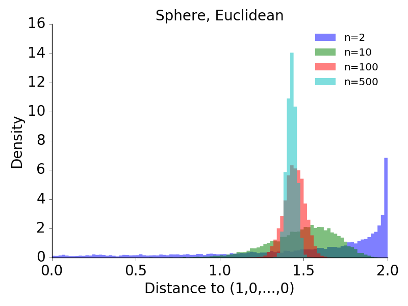
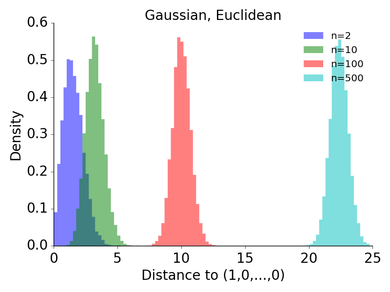
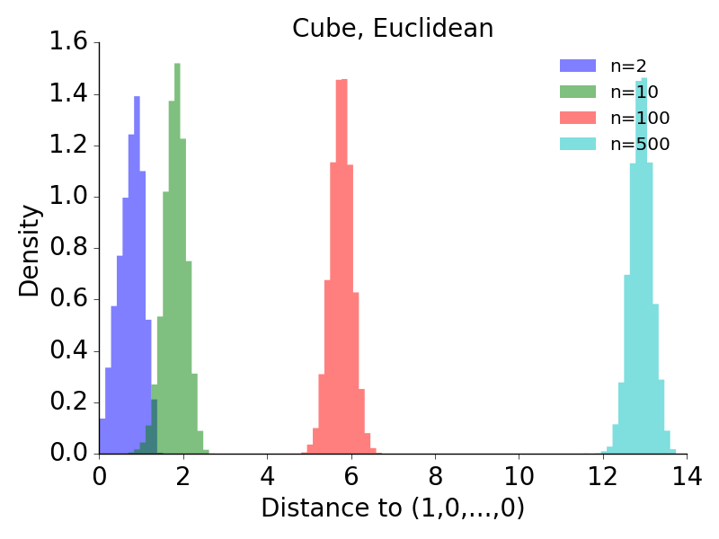
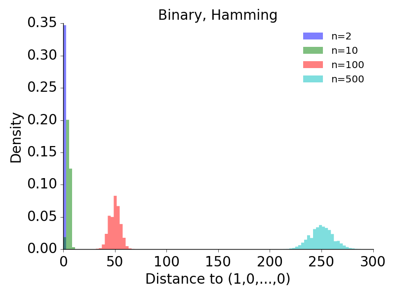
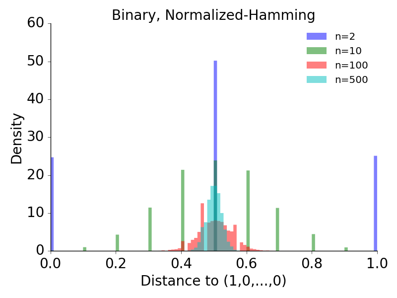
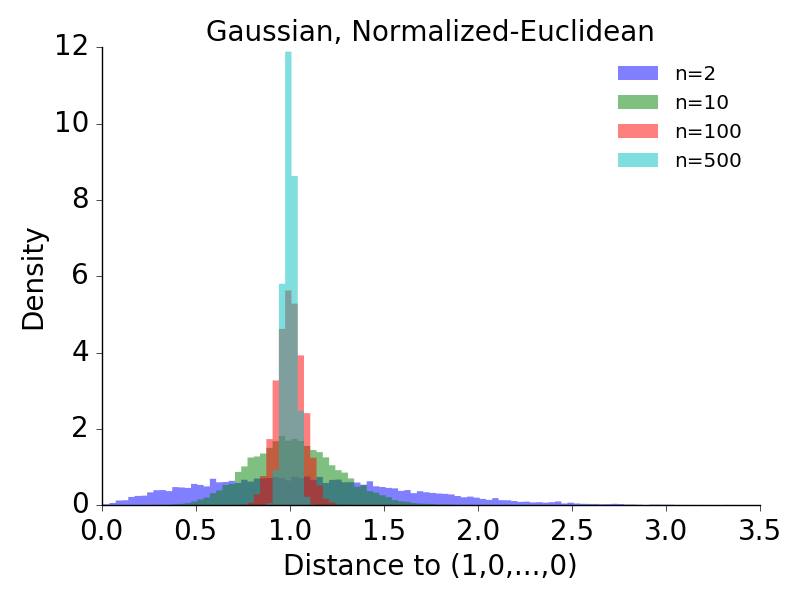
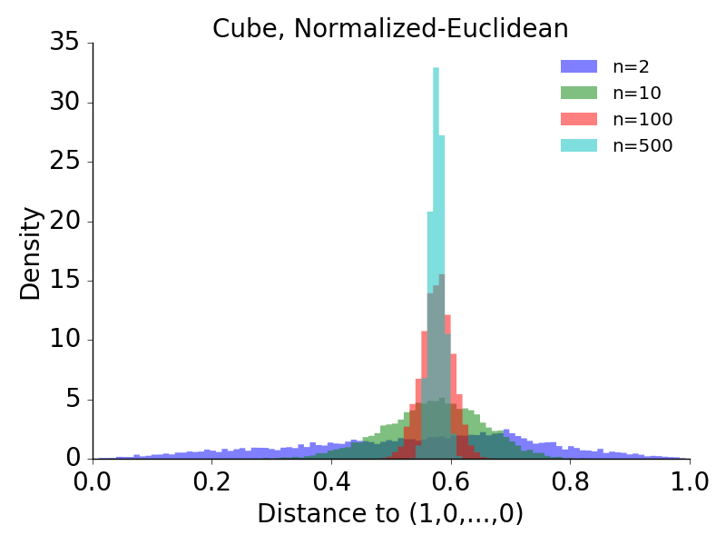

# 高次元データの点間距離の分布 (2016/10/27)

## 説明

* 球面集中現象について調べていたところ、「高次元空間にデータ点が分布しているとき、ある点に注目すると、その点から他の点までの距離はどれもほぼ同じような値になる」という主張を見かけた。詳細は
[別ページ](../20161025/memo.html)を参照。

* 球面集中現象との関係はさておき、そもそもこの主張自体が本当に正しいのかどうか、数値計算により調べてみた。

* 参照点を $(1,0,...,0)$ とし、そこから他の10000点までの距離の分布がデータの次元によりどう変化するかを調べた。

* 結論としては、距離のスケールが $n$ によらず一定となるような状況では、上記の主張は正しいようだ。


## 球面上、一様分布、ユークリッド距離の場合

* これは L&eacute;vy family (次元が大きくなると集中率 $\alpha$が0に近付くもの) なので、参照点からの距離は次元が大きくなるほど中央値付近に集中することが分かっている。実際にそうなっていることが数値計算により確認出来た。



## 球面上、一様分布、測地距離の場合

* 距離の測り方を変えて球面上の最短弧長で計算した場合も、L&eacute;vy family になることが知られている。やはり次元が大きくなるほど分布の幅が狭くなっている。


## $R^n$上、ガウス分布、ユークリッド距離の場合

* これは集中率 $\alpha$が $n$ に依存しないケースで、実際に数値計算をしてみると距離の分布の形は $n$ によらずほぼ一定で、中心の位置だけが横にずれていく様子が観察された。

* 高次元になるほど近傍点が見つかりにくくなるのは間違いないが、距離がある一定値に集中する、という言い方がこの場合果たして適切と言えるかどうかは分からない。



## $[0,1]^n$上、一様分布、ユークリッド距離の場合

* 上とよく似た例としてハイパーキューブ内の一様分布も調べた。傾向は同じで、距離の分布の形は $n$ によらずにほぼ一定で、平均値だけが変化していた。



## $\{0,1\}^n$上、一様分布、ハミング距離の場合

* 二値変数の場合も調べた。ハミング距離の分布は $n$ が大きくなるほど広がり、平均も大きくなっている。



## $\{0,1\}^n$上、一様分布、正規化ハミング距離の場合

* ハミング距離の最大値が1となるよう正規化すると L&eacute;vy family になるという記述を見かけたので試してみた。$n$ が大きくなるにつれ距離の分布が0.5に集中していく様子が見られる。

* これは具体的に状況をイメージしやすく、長いバイナリ列同士を比較すれば、大体半分程度が一致し、残り約半分が反転している、という状況が起こりやすいのは直感と合っている。



## $R^n$上、ガウス分布、正規化ユークリッド距離の場合と $[0,1]^n$上、一様分布、正規化ユークリッド距離の場合

* 距離を正規化すると良いと分かったので、ガウシアンとハイパーキューブの場合についても正規化距離に変えてみた。$n$ が大きくなるにつれ距離の分布が狭まっているのが分かる。

* なお、ガウシアンの方は距離の最大値というものが存在しないので、ハイパーキューブと同様に $\sqrt{n}$ で割ったが、どうやらこれで良かったようだ。

* また、参照点の位置を変えると分布の変化の様子が変わるものの、分布の幅が狭くなっていくという意味では同じだった。






## 計算に用いたプログラムのソースコード

* 参考までにソースコードを載せる。Python3で書いた。

```
import sys
import numpy as np
import matplotlib.pyplot as plt

def generate_data(n_dim, n_samples, data_type):

  if data_type == 'sphere':
    data_arr = 2 * np.random.randn(n_samples, n_dim) - 1
    norm_arr = np.linalg.norm(data_arr, axis=1)
    data_arr /= norm_arr[:, np.newaxis]
  elif data_type == 'gaussian':
    data_arr = np.random.randn(n_samples, n_dim)
  elif data_type == 'cube':
    data_arr = np.random.rand(n_samples, n_dim)
  elif data_type == 'binary':
    data_arr = np.random.randint(2, size=(n_samples, n_dim))
  else:
    raise ValueError("data_type must be 'sphere', 'gaussian', 'cube', or 'binary'.")
  return data_arr

def calculate_distances(data_arr, ref_pos, dist_type):
  if dist_type == 'euclidean':
    dist_arr = np.linalg.norm(data_arr - ref_pos, axis=1)
  elif dist_type == 'normalized-euclidean':
    dist_arr = np.linalg.norm(data_arr - ref_pos, axis=1) / np.sqrt(len(ref_pos))
  elif dist_type == 'hamming':
    dist_arr = np.abs(data_arr - ref_pos).sum(axis=1)
  elif dist_type == 'normalized-hamming':
    dist_arr = np.abs(data_arr - ref_pos).sum(axis=1) / len(ref_pos)
  elif dist_type == 'geodesic':
    dist_arr = np.arccos(np.dot(data_arr, ref_pos))
  else:
    raise ValueError("dist_type must be 'euclidean', 'normalized-euclidean', 'hamming', 'normalized-hamming', or 'geodesic'.")
  return dist_arr


def test_concentration_of_measure(data_type, dist_type):

  # simulation parameters
  n_dim_list   = [2, 10, 100, 500]
  n_samples    = 10000

  # plot options
  bins         = 100
  alpha        = 0.5
  fontsize     = 20


  ### calculate distribution of distances  ###
  dist_arr_list = []
  for n_dim in n_dim_list:

    # generate data points
    data_arr = generate_data(n_dim, n_samples, data_type)

    # set the reference position to (1,0,0,...,0)
    ref_pos = np.zeros(n_dim)
    ref_pos[0] = 1.0

    # calculate distances to the reference
    dist_arr = calculate_distances(data_arr, ref_pos, dist_type)
    
    dist_arr_list.append(dist_arr)

  # range of the distribution
  d_min = np.min(dist_arr_list)
  d_max = np.max(dist_arr_list)


  ### plot histogram  ###
  fig, ax = plt.subplots(figsize=(8,6), facecolor='white')

  for n_dim, dist_arr in zip(n_dim_list, dist_arr_list):
    label = 'n={}'.format(n_dim)
    ax.hist(dist_arr, bins=bins, histtype='stepfilled', range=(d_min, d_max),
            lw=0, alpha=alpha, normed=True, label=label)

  # plot settings
  ax.set_title(data_type.title() + ', ' + dist_type.title(), 
               fontsize=fontsize)
  ax.set_xlabel('Distance to (1,0,...,0)', fontsize=fontsize)
  ax.set_ylabel('Density', fontsize=fontsize)
  ax.spines['top'].set_visible(False)
  ax.spines['right'].set_visible(False)
  ax.xaxis.tick_bottom()
  ax.yaxis.tick_left()
  ax.tick_params(direction='out', pad=5)
  ax.tick_params(labelsize=fontsize)
  plt.legend(frameon=False)
  fig.tight_layout()
  plt.show()
  plt.savefig('fig.png')


if __name__ == '__main__':
  data_type = sys.argv[1] # 'sphere', 'gaussian', 'cube', or 'binary'
  dist_type = sys.argv[2] # 'euclidean', 'normalized-euclidean', 'hamming', 'normalized-hamming', or 'geodesic'
  test_concentration_of_measure(data_type, dist_type)
```
