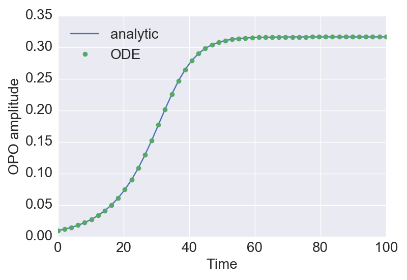
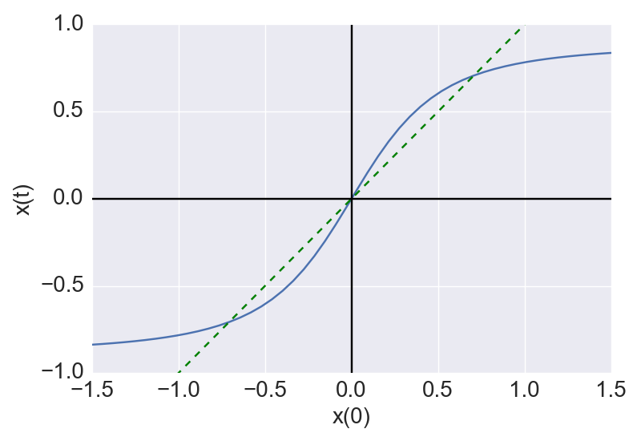

# 単一のDOPOパルスの振幅の時間発展の解析解 (2017/02/22)

## 説明

* CIMで、ある一つのDOPOパルスがFPGAからのフィードバックを受けた後、リング共振器を回って再び検出器に到達するまでの間、つまり、他のパルスとの相互作用が無い区間での振幅の時間発展を表す解析解を確認した。

* 要するに、ピッチフォーク分岐の標準形の解である。

* (2017.02.23修正) 場合分けをきちんと考えた。結局、$\mu=0$を除けばどの場合も同じ式で表せることが確認出来た。

## 計算

* 単一のDOPOパルスの時間発展の式 (都合により $c=x$, $p-1=\mu$ と置き直し、ノイズは無視した)
    $$\begin{align}
    \frac{dx}{dt} = x (\mu - x^2).
    \end{align}$$

### (i) $\mu<0$の場合

* 原点が安定固定点

* 原点に近付いていくだけなので、初期値が正なら $x(t)$ は $t$ によらず常に正, 初期値が負なら常に負, 初期値が0なら常に0である。

* 微分方程式を解く (積分のところはsympy利用、積分定数は初期条件 $x(0)=x_0$ より決定)
    $$\begin{align}
    \frac{dx}{x (\mu - x^2)} &= dt,\\
    \int\frac{dx}{x (\mu-x^2)} &= \int dt,\\
    \frac{1}{2\mu}\ln\frac{x^2}{x^2-\mu}&=t+\frac{1}{2\mu}\ln\frac{x_0^2}{x_0^2-\mu},\\
    \ln\frac{x^2(x_0^2-\mu)}{x_0^2(x^2-\mu)}&=2\mu t,\\
    \frac{x^2(x_0^2-\mu)}{x_0^2(x^2-\mu)}&=\mathrm{e}^{2\mu t},\\
    x^2(x_0^2-\mu)\mathrm{e}^{-2\mu t}&=x_0^2(x^2-\mu),\\
    x&=x_0\sqrt{\frac{-\mu}{(x_0^2-\mu)\mathrm{e}^{-2\mu t}-x_0^2}}.
    \end{align}$$

* ルートの中の分母が $t\geq 0$ で常に正になることも確認出来る。注意点として、時間を逆方向にまわすと有限の $t$ で分母が0になり解が発散する。

### (ii) $\mu>0$, $x_0^2>\mu$の場合

* 原点が不安定固定点、$x=\pm\sqrt{\mu}$が安定固定点

* それぞれの安定固定点に外側から近付くので、$x_0^2>\mu$ なら $x(t)^2>\mu\ (\forall t\geq 0)$ である。また、初期値が正なら $x(t)$ は常に正、初期値が負なら常に負である。

* 微分方程式を解くと、結局 (i) と同じ式になる (下の式では分かりやすいようルートの中の分母と分子にそれぞれ $-1$ を掛けている)
    $$\begin{align}
    \frac{dx}{x (\mu - x^2)} &= dt,\\
    \int\frac{dx}{x (\mu-x^2)} &= \int dt,\\
    \frac{1}{2\mu}\ln\frac{x^2}{x^2-\mu}&=t+\frac{1}{2\mu}\ln\frac{x_0^2}{x_0^2-\mu},\\
    x&=x_0\sqrt{\frac{\mu}{x_0^2-(x_0^2-\mu)\mathrm{e}^{-2\mu t}}}.
    \end{align}$$

* この場合もルートの中の分母が $t\geq 0$ で常に正になることが確認出来る。ただし、(i)と同様に、時間を逆方向にまわす場合は有限の $t$ で分母が0になり解が発散する。

### (iii) $\mu>0$, $x_0^2<\mu$の場合

* 原点が不安定固定点、$x=\pm\sqrt{\mu}$が安定固定点

* それぞれの安定固定点に内側から近付くので、$x_0^2<\mu$ なら $x(t)^2<\mu\ (\forall t\geq 0)$ である。また、初期値が正なら $x(t)$ は常に正、初期値が負なら常に負であり、原点が固定点なので初期値が0なら常に0である。

* 微分方程式を解くと、積分の際に符号が変わるものの、結局 (i), (ii) と同じ式になる。
    $$\begin{align}
    \frac{dx}{x (\mu - x^2)} &= dt,\\
    \int\frac{dx}{x (\mu-x^2)} &= \int dt,\\
    \frac{1}{2\mu}\ln\frac{x^2}{\mu-x^2}&=t+\frac{1}{2\mu}\ln\frac{x_0^2}{\mu-x_0^2},\\
    \ln\frac{x^2(\mu-x_0^2)}{x_0^2(\mu-x^2)}&=2\mu t,\\
    \frac{x^2(\mu-x_0^2)}{x_0^2(\mu-x^2)}&=\mathrm{e}^{2\mu t},\\
    x^2(\mu-x_0^2)\mathrm{e}^{-2\mu t}&=x_0^2(\mu-x^2),\\
    x&=x_0\sqrt{\frac{\mu}{x_0^2+(\mu-x_0^2)\mathrm{e}^{-2\mu t}}}.
    \end{align}$$

* ルートの中の分母は $t$ によらず常に正になることが確認出来る。

### (iv) $\mu=0$の場合

* 微分方程式
    $$\begin{align}
    \frac{dx}{dt} = -x^3.
    \end{align}$$

* これを解くと、以下が得られる。
    $$\begin{align}
    x(t) = \frac{x_0}{\sqrt{2x_0^2t+1}}.
    \end{align}$$

### (i), (ii), (iii), (iv) のまとめ

* $\mu\neq 0$の場合、解析解は以下の式で表せる:
    $$\begin{align}
    x(t)&=x_0\sqrt{\frac{\mu}{x_0^2+(\mu-x_0^2)\mathrm{e}^{-2\mu t}}}.
    \end{align}$$

* $\mu=0$の時だけ特殊で、解析解は以下の式になる:
    $$\begin{align}
    x(t) = \frac{x_0}{\sqrt{2x_0^2t+1}}.
    \end{align}$$

## 図

* 一応ODEと比較して合っていることを確認 (図は $\mu=0.1$ の場合)
  

* 一定時間経過による振幅の変化 (図は $\mu=0.5$, $t=1$ の場合)
  