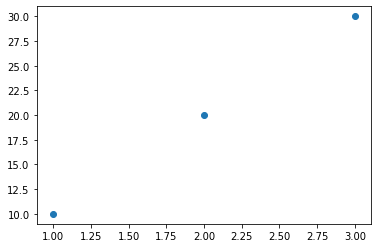

# Python入門 (2019/12/25)

## 起動方法

1. 画面左下の窓マークをクリック
2. Jupyter Notebookをクリック (練習環境の場合)
3. フォルダ一覧が表示されるのでDocumentsをクリック
4. 以下のいずれかを選ぶ
  * 新規作成の場合は、画面右上のNewボタンを押して、Python 3を選択
  * 既にあるファイルを開く場合は、一覧にあるファイルをクリック

## 実行方法

画面に表示されている横長の四角形を**セル**と呼びます。このセルの中にコマンドを入力し、画面上のRunボタンを押すか、あるいはキーボードのShiftとControlの同時押しをすると、その内容をコンピュータが解釈して実行します。

## print
まずは以下のコマンドを実行してみて下さい。セルのすぐ下にhelloという文字列が表示されたらOKです。

```python
print('hello')
```


printというのはコンピュータに文字列や数値を表示させるためのコマンドです。helloを別の文字列に変えても構いません。

もしエラーになってしまう場合は、ちゃんとhelloの両側を ' で囲んでいるか、さらにその外側を丸括弧でちゃんと囲んでいるか、printと左の括弧の間にスペースが入っていないかなどを確認して下さい。

プログラミング言語は、日本語や英語などの「人のための言語」でなく、「コンピュータのための言語」です。そのため、ちょっとしたスペースの有無の間違い、ピリオド (.) とコンマ (,) の間違い、丸括弧と角括弧の間違いなどでも、コンピュータにとっては理解不能ということがよく起こります。

## 四則演算
足し算、引き算、掛け算、割り算も出来ます。掛け算の記号は \* を使います。

```python
1+1
```


```python
1-1
```


```python
2*3
```


```python
5/2
```


## 変数
コンピュータに値を覚えさせておくことが出来ます。まず、以下のコマンドを実行してみて下さい。

```python
x=10
```

何も起こりませんね。それで合っています。これで「xは10である」ことをコンピュータが覚えました。本当に覚えているか、次のセルに x とだけ入力して実行してみて下さい。10と表示されればOKです。

```python
x
```


このように値を保存したものを**変数**と呼びます。また、変数に値を設定することを**代入**と呼びます。

## リスト
変数は1つの数値だけでなく、複数の数値のグループをまとめて1つの変数で表すこともできます。以下のコマンドを実行し、ちゃんと覚えているかその次のセルで確認してみて下さい。

```python
x=[10,20,30]
```

```python
x
```


このように角括弧で囲んだ複数要素のグループをPythonでは**リスト**と呼びます。

ここで大事な注意として、Pythonでは**順番を1からではなく0から数えます**。上の例では、10は0番目、20が1番目、30が2番目、という数え方になります。

リストのうち1つだけを取り出すには、以下のようにして番号を指定します。

```python
x[0]
```


## for文
コンピュータは繰り返し処理が得意です。同じような処理を何度もコンピュータにさせたい場合、それを簡単に書くための**for文**という記法があります。まずは以下のコマンドを実行してみて下さい。

```python
for i in [1,2,3]:
    print('hello')
```


急に難しくなりましたが、とにかく同じ文字列が3回表示されればOKです。

もしエラーになってしまう場合は、文字と文字の間のスペースの有無、大文字小文字、角括弧と丸括弧、1行目の最後のコロン、2行目が1行目より右にずれているか (ずれているのが正解です)、などを確認して下さい。

この文は、実際は以下と同じ処理です。つまり、リスト [1,2,3] にある値を1つずつ順番に変数 i に代入し、2行目のコマンドを実行する、という意味です
、、、が、もしよく分からない場合は、何かの呪文だと思って下さい。

```python
i=1
print('hello')
i=2
print('hello')
i=3
print('hello')
```


## if文
for文と並んで大事なのがif文という記法です。すぐ上の例で、i=2のときだけ出力を変えてみましょう。以下のようにします。

```python
for i in [1,2,3]:
    if i==2:
        print('hi')
    else:
        print('hello')
```


こちらは、英語の意味を考えるとfor文よりは分かりやすいのではないかと思います。if は「もしも」、elseは「そうでなければ」という意味です。つまり、条件によって処理を変えています。

もしエラーになってしまう場合は、行末のコロンや右方向へのずれ（インデントと呼びます）具合がちゃんと合っているかを確認して下さい。ifとelseのインデント量は同じです。また、print文はifやelseよりもさらに右にずらす必要があります。

「i==2」でイコールを2つ使う理由は、イコール1つは変数の代入の意味になってしまうので、それとは違う意味であることをコンピュータに伝えるためです。逆にイコールではないことを表すには以下のように != を使います。

```python
for i in [1,2,3]:
    if i!=2:
        print('hi')
    else:
        print('hello')
```


## 関数
プログラミングをしていると、一度書いたコードを他の箇所でも使いたいという状況がよく出てきます。その場合、コピー&ペーストしても良いですが、コードのまとまり（**関数**と呼びます）に適当な名前を付け、それを呼び出すということも出来ます。以下は、それ自体は関数としてまとめる必要のない短いコードですが、関数の書き方の例です。funcという名前は変えても構いません。

```python
def func():
    print('hello')
```

これを実行しても何も出力されませんが、それで合っています。先ほどの変数の代入と同様、コンピュータがこの関数について覚えたのです。本当に覚えているかどうか、関数を呼び出してみましょう。

```python
func()
```


関数には入力と出力を付けることが出来ます。上の例はどちらも無いバージョンでした。入力は、丸括弧の中に以下のように書きます。

```python
def func(x):
    print(x)
```

```python
func(10)
```


ここが少し分かりづらいですが、関数を呼ぶときに入力した値（上の例では10）が、関数定義の際に書いた変数 x に代入された後、その関数の処理が実行されます。説明していませんでしたが、printは、中身が変数のときは ' で囲まないで下さい。

入力を変えると x が変わります。

```python
func(20)
```


出力は **return** というのを使います。以下は入力値に1を足した値を出力する関数の例です。

```python
def func(x):
    return x+1
```

ポイントは、出力結果を他の変数に代入出来る、ということです。試しに y という変数に結果を入れてみましょう。

```python
y=func(10)
```

yの値を確かめてみます。

```python
y
```


## numpyパッケージ

実際にデータ解析をする際は、自分で関数を書くよりも、他の誰かが書いてくれた便利な関数を頂いてきて利用することの方が圧倒的に多いです。特に、一連の関数（とその関連物）をまとめたパッケージが幾つもあり、それらをどれだけ知っているかが大事になってきます。

まずは有名なnumpyから説明します。以下のようにしてインポートします。

```python
import numpy as np
```

as npというのは、numpyというのは名前が長いため、ソースコード内では np と略記します、という意味です。

numpyの関数を少しだけ紹介します。以下は三角関数の一つのsin関数です。

```python
np.sin(3.14)
```


sin の前に np. を付ける理由は、もしも自分で定義した関数に偶然同じ名前のものがいた場合に困るので、numpyから持ってきた関数はそれと分かるようにするためです。

もう一つの例として、以下はリストの中の最大値を選ぶ関数です（np. 無しでも動作するという話は説明が面倒なのでここでは置いておきます）。

```python
np.max([1,2,3])
```


以下は、ランダムな値の羅列を作る関数です。randnのnは正規分布 (normal distribution) のnです。

```python
np.random.randn(5,2)
```


ひとまずここではnumpyには便利な関数があるということが分かればOKです。

## 図の描画用パッケージ

つまらない話ばかり続いたので（プログラミング言語について説明するには避けて通れないとはいえ）、そろそろ図を描いてみようと思います。長ったらしい名前ですが、以下のものをインポートして下さい。

```python
import matplotlib.pyplot as plt
```

これで大抵の図は書けます。まずは plot 関数で折れ線グラフを描いてみましょう。

```python
plt.plot([1,10,100])
```


続いて点のプロット（散布図と呼びます）をする scatter という関数です。最初のリストがx座標、もう一つがy座標です。

```python
plt.scatter([1,2,3],[10,20,30])
```




レポートなどに図を貼り付けたい場合は、一旦図だけを別に保存する必要があります。図を右クリックして保存すれば出来ます（教えて貰いました）。

## pandasパッケージ
続いてpandasパッケージの説明です。これはExcelファイルのように縦横に数字や文字が並んだ表形式データを扱うためのものです。インポートは以下のようにします。

```python
import pandas as pd
```

それでは練習用のデータを用意します。適当にExcelファイルを新規作成して、1行目は何か文字列 (例えばaとかbとか）、2行目から6行目までは何でもいいので何かの数字を入れた、2列のデータを作って下さい。以下のような感じです。

|a|b|
|-|-|
|1|1|
|4|7|
|1|3|
|4|2|
|2|0|

出来たらそれを「名前を付けて保存」の際に「ファイルの種類」を**CSV**にしてDocumentsフォルダに保存して下さい。ファイル名は何でも良いです。ここではtest.csvとして説明しますが、適宜読み替えて下さい。

pandasはExcelファイル自体は読み込めません。しかし、csvファイルは読み込むことが出来ます。そこで使うのが read_csv という関数です。

```python
x=pd.read_csv('test.csv')
```

確認します。左に行番号が自動で振られています。

```python
x
```

この表形式のデータのある1列だけを取り出すには2つの方法があります。一つ目は以下にドットの後に列名を繋げる書き方です。この方法は列名が英数字のみの場合に使えます。

```python
x.a
```


もう一つは以下のように角括弧と ' を使う書き方です。こちらの方法は列名が日本語だったりスペースを含んでいたりしても大丈夫です。

```python
x['a']
```


では、このデータを使って先ほど紹介した折れ線グラフや散布図を描いてみましょう。

```python
plt.plot(x.a)
```


```python
plt.scatter(x.a,x.b)
```


## seabornパッケージ
先ほど図の描画用パッケージの話をしました。大抵の図はそれだけで充分ですが、ここではseabornというのを紹介します。インポートは以下のようにします。

```python
import seaborn as sns
```

以下は、表形式データを色で表示した図（ヒートマップと呼びます）を描く関数です。

```python
sns.heatmap(x)
```


## 保存方法と再開方法
ファイルは一定時間毎に保存されています。強制的に保存するにはControl+Sを押して下さい。ファイルはDocumentsフォルダ内にあります。ファイル名は初期状態ではUntitledとなっています。名前を変更するには、画面左上のJupyterという文字のすぐ右のファイル名をクリックして下さい。

確認のため、一旦プログラミング環境を全て切ってから再度立ち上げ、ファイルを開いてみて下さい。

一見すると全て元通りですが、変数の代入、関数の定義、各パッケージのインポートのことなど、コンピュータは全て忘れてしまっています。試しに一番最後のセルを実行してみるとエラーが出るはずです。もう一度上から順に関係ありそうなセルを実行していけば大丈夫です。
