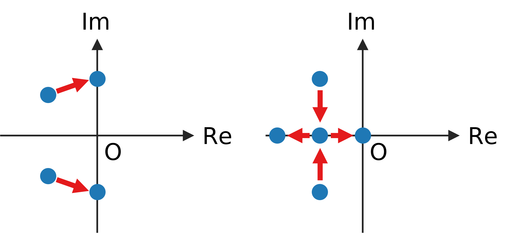

# ポテンシャル上で転がる球のモデル (2023/06/28)

* ポテンシャル: $U=ax^2$, $\nabla U=2ax$

* $x$ における斜面の角度: $\theta=\arctan 2ax$

* 斜面方向の力: $mg\sin\theta$, 法線方向の力: $mg\cos\theta$

* 摩擦力 ($\dot x$ にも比例すると仮定): $\mu\dot x mg\cos\theta$

* 運動方程式
  $$m\ddot x = (-mg\sin\theta - \mu\dot x mg\cos\theta)\cos\theta$$

* $\theta\approx 0$ の場合、$\cos\theta\approx 1$, $\sin\theta\approx \tan\theta=2ax$ より、
  $$m\ddot x \approx -2amgx - \mu mg\dot x$$

* これは、バネ定数を $k=2amg$, ダンパー係数を $c=\mu mg$ とおいた場合のmass-spring-damper系に相当する。
  $$m\ddot x = -kx - c\dot x$$

* ポテンシャルが浅くなることは $a\to 0$ であり、これは $k\to 0$, つまり、バネが弱くなることに対応する。

* 行列表記
  $$\frac{\mathrm{d}}{\mathrm{d}t}
  \left(\begin{array}{c}x\\ \dot x\end{array}\right)
  =\left(\begin{array}{cc}0&1\\-k/m&-c/m\end{array}\right)
  \left(\begin{array}{c}x\\ \dot x\end{array}\right)$$

* 固有値を計算
  $$|\lambda I-A|=\left|\begin{array}{cc}\lambda&-1\\k/m&\lambda+c/m\end{array}\right|
  =\lambda^2+\lambda c/m+k/m=0$$
  $$\lambda = \frac{-c\pm\sqrt{c^2-4mk}}{2m}$$

* バネ定数 $k$ が十分大きい場合、固有値は複素共役対になる。バネ定数を小さくしていくといずれも実数になり、最終的に片方が $0$ に達して不安定化する。

* 早期警戒信号 (early warning signal) の観点からは、ノイズに駆動された振動の周期が長くなることが利用出来るかもしれない。

# (2023/06/29追記) 一般の場合

* 対象システム
  $$\frac{\mathrm{d}}{\mathrm{d}t}
  \left(\begin{array}{c}x_1\\x_2\end{array}\right)
  =\left(\begin{array}{cc}a&b\\c&d\end{array}\right)
  \left(\begin{array}{c}x_1\\x_2\end{array}\right)$$

* 固有値を計算
  $$|\lambda I-A|=\left|\begin{array}{cc}\lambda-a&-b\\-c&\lambda-d\end{array}\right|
  =\lambda^2-(a+d)\lambda+ad-bc=0$$
  $$\lambda = \frac{a+d\pm\sqrt{(a+d)^2-4(ad-bc)}}{2}$$

* 正常状態で系が安定であり、かつ、$\lambda$ が複素共役とする。
  $$a+d<0,\quad (a+d)^2-4(ad-bc) < 0$$

* 4つのパラメータ $a,b,c,d$ のうち、どれか1つだけが変化して系が不安定化する状況を考える。

  1. $a$ または $d$ が変化する場合、複素共役のまま虚軸に達する。また、虚部の絶対値は増加する。

  2. $b$ または $c$ が変化する場合、固有値が衝突して実数になってから、一方が0に達する。

