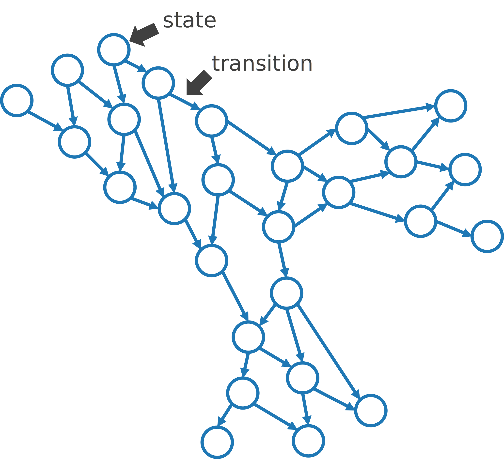
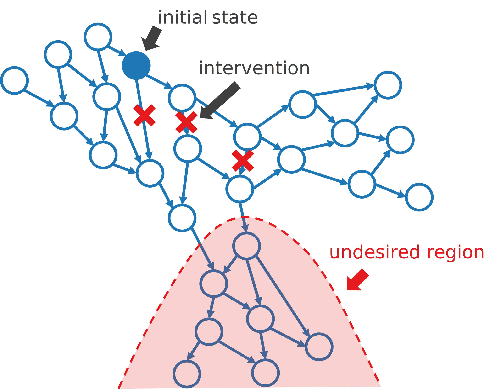

# ヒトを対象とした制御理論について考えたこと (2024/03/22)

## 前置き

ムーンショット研究でヒトの未病段階を対象とした制御理論を扱っています。私は制御理論も医学も詳しくありませんが、この研究テーマに関して共同研究させて頂いています。素人ながら考えたことを以下に書きます。的外れかもしれません。

## 人工システムと生体システムの違い

制御理論は蒸気機関を始めとして人工システムを対象に発展したきたものだと聞いたことがあります。人工システムの場合、対象の動作を記述する数理モデルがかなり正確に分かっていること、必要な状態変数が容易に測定可能なこと、制御器を入れたフィードバックループを容易に構築可能なこと、などが通常は仮定出来ると思います。例えば、簡単な線形時不変システムを考えるとします。状態変数 $x(t)\in\mathbb{R}^n$, システム行列 $A\in\mathbb{R}^{n\times n}$ を用いて、対象システムは次のように記述出来るとします。
$$\dot x(t)=Ax(t).$$
通常はここに制御入力 $u(t)\in\mathbb{R}^n$ を加えて系を安定化しようとします。行列 $B\in\mathbb{R}^{n\times n}$ を用いて次のように書けます。
$$\dot x(t)=Ax(t)+Bu(t).$$
さらに、状態変数 $x(t)$ の観測値を元にフィードバックを計算する場合は、行列 $K\in\mathbb{R}^{n\times n}$ を用いて次のように書けます。
$$u(t)=Kx(t),\quad \dot x(t)=(A+BK)x(t).$$
つまり、元のシステム行列 $A$ をフィードバック制御付きの行列 $A+BK$ に置き換えることにより系を安定化できれば良いという話になります。このアプローチは、行列 $A$, $B$ が既知であり、状態 $x(t)$ を各時刻で継続的に測定することが容易であり、制御入力 $u(t)$ を各時刻で継続的に加えることも容易であることが前提です。

一方、生体システムでは上記の3つの前提がほとんどの場合に当てはまりません。まず、生体システムの挙動を記述する数理モデルを実用レベルで推定することは現時点で不可能です。生体システムは非線形、時変、非自律、遅延あり、高次元、階層的です。階層的の部分だけとってみても、臓器、組織、細胞、分子まで様々なスケールがあり、それらが神経系、内分泌系、免疫系などを介して相互に影響を及ぼし合っています。また、状態変数の測定に関しては、たとえ測定対象とする状態変数を絞ったとしても、継続的な測定にはコストがかかります。入院中の場合を除くと、スマートウォッチによる心拍などの測定、24時間血圧測定、持続的血糖モニタなど、実際に使われているものは限られます。制御入力も同様で、測定値を元に投薬や電気刺激などでヒトに対しフィードバックを行うことは、一部の疾患を除いて極めて難しいと考えられます。

このように、人工システムを念頭に構築されてきた制御理論を生体システムに当てはめることは容易でなく、様々な課題を解決する必要があると思います。

## 発想の転換

良い数理モデルが得られない場合はモデルフリーの手法に切り替えるのが正攻法です。データ駆動形アプローチとも呼びます。色々な方法がありますが、ここでは、近い状態点は短期的に似た時間発展をすると仮定し、観測データから推定した状態遷移行列を使う方法を考えます。また、継続的な制御入力が困難なので、なるべく限られた状態のみで介入を行う制御を目指します。残念ながら、継続的な状態測定の問題の対策法は分かりません。

下の図で説明します。各状態を頂点、遷移を重み付き有向枝とするグラフを考えます。各頂点は一般に多次元の状態変数のベクトルに対応します。同一個体から時間的に連続した測定をした場合は、対応する頂点間に重みの大きい枝を張ります。加えて、各頂点から、それと近い状態の遷移先に対しても枝を張ります。重みは状態間の近さなどにより調節します。この部分が難しいと思いますが、仮にうまく出来たとして話を進めます。得られた有向グラフを $G=(V,E)$ とし、頂点数を $|V|=n$, 各枝の重みを $w_{ij}$ とします。

続いて、望ましくない状態の集合 $S$ を決めます。例えば、特定の疾患を発症している状態などです。直感的には、この範囲に入る直前で介入をしても手遅れで発症を抑えることができない可能性が高いだろうと考えられます。一方で、あまりに早くから遠ざかる方向に制御をかけてもコストに見合わないだろうとも考えられます。従って、初期状態の位置を考慮して必要な箇所のみで介入を行い、軌道を変えて望ましくない状態に入らないようにする方法を考えることにします。

マルコフ連鎖モデルを使います。確率ベクトルを $x(t)\in\mathbb{R}^n$, 遷移行列を $A\in\mathbb{R}^{n\times n}$ とします。$A_{ij}$ は枝の重み $w_{ij}$ に基づいて何らかの方法で決めます。確率なので、$A_{ij}\geq 0$, $\sum_i A_{ij}=1$ を満たすようにします。初期値を $x(0)=x_0$ として、系の時間発展は次のように書けます。
$$\begin{align}x(t+1)&=Ax(t),\\
x(t) &= A^tx_0.\end{align}$$

ここに制御入力を加えます。行列 $A$ を $A+K$ に置き換えることで、指定した時間範囲 $t\in[0,T]$ 内に望ましくない状態集合 $S$ に入る確率をなるべく小さく、かつ、行列 $K$ をなるべくスパースにするような最適化問題を考えます。そもそも病気の発症を $100$ % 防ぐことなど不可能なので、集合 $S$ への侵入確率を $0$ とすることは目指しません。$A+K$ も非負で列和が $1$ とします。$K$ がスパースであれば、限られた状態間の遷移さえ防げれば発症を効率的に予防出来るということになります。その遷移を防ぐ具体的な介入手段については専門家と相談することになります。現実的に不可能であれば最適化問題に制約を追加するなどの対応が考えられます。

細かい部分の実装はおいておくとして、大まかな流れは以上です。極めて素朴なアイデアなので、既にどこかの誰かが論文を出しているだろうとは思います。それを調べる時間的余裕がないので、取り敢えずメモしておきました。

補足です。このようなグラフ $G$ が得られているなら、それは高精度の発症予測が可能であることとほぼ同義なので、それ自体が難しいことなのはもちろんです。良い発症予測法が既にあって、どのような状態変数に着目して $G$ を作れば良いかが分かっている状況を想定して書きました。